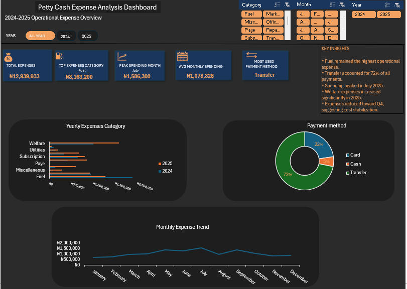

## Project Overview!
This project focuses on analyzing operational petty cash expenses from 2024–2025 using Excel.

The aim of the analysis was to transform raw operational expense records into meaningful business insights that can support better financial decision-making and expense monitoring.

Through this project, I cleaned messy raw data, built Pivot Tables, created interactive charts, and designed a dashboard to identify operational spending patterns, high-cost categories, and payment behavior.

---

## Business Problem
Many businesses struggle to properly monitor operational expenses due to scattered records, manual tracking, and lack of visibility into spending patterns.

Without proper monitoring:
- operational costs increase unnoticed,
- unnecessary spending affects profitability,
- and decision-making becomes difficult.

This analysis was carried out to better understand:
- where operational money was going,
- which expense categories consumed the most resources,
- and how spending changed over time.

---

## Business Questions
The project aimed to answer the following questions:

- Which expense category consumed the most money?
- How did expenses change monthly?
- Which month had unusually high spending?
- Which operational area drove the most expenditure?
- Which payment method was used the most?

---

## Tools Used
- Microsoft Excel
- Power Query
- Pivot Tables
- Pivot Charts
- Slicers
- Dashboard Design

---

## Data Cleaning Process
The dataset was cleaned and transformed using Power Query.

Some of the cleaning steps included:
- correcting inconsistent category names,
- removing formatting issues,
- standardizing text values,
- changing data types,
- trimming extra spaces,
- and preparing the data for analysis.

---

## Dashboard Features
The dashboard includes:
- KPI Cards
- Monthly Expense Trend Analysis
- Yearly Expense Category Comparison
- Payment Method Distribution
- Interactive Slicers
- Business Insight Summary

---

## Key Insights
Some important insights uncovered from the analysis include:

- Fuel remained the highest operational expense category.
- Transfer accounted for the highest percentage of transactions.
- Spending peaked around July.
- Welfare and transport expenses increased significantly in 2025.
- Expenses reduced toward Q4, suggesting possible cost stabilization.

---

## Business Impact
This dashboard helps improve:
- expense visibility,
- operational monitoring,
- budgeting decisions,
- financial accountability,
- and cost management.

The analysis also reflects how inflation, transportation costs, and rising operational expenses can affect business sustainability.

---

## Dashboard Preview
(Add your dashboard screenshot here)

---

## What I Learned
This project helped strengthen my skills in:
- Data Cleaning
- Dashboard Storytelling
- Business Analysis
- Data Visualization
- Operational Expense Analysis
- Excel Dashboard Design

It also improved my ability to turn raw operational records into actionable business insights.

